<h1 align="center">Olusion</h1>

<div align="center">
  
  
  
  
</div>

<p align="center">
  A low-poly 3D <b>survival game for Android.</b>
</p>

<br>

<div align="center">
  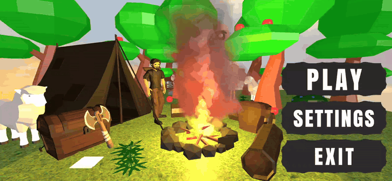
  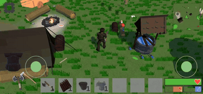
</div>

---

## 📖 About
A 3D survival game for Android, built in Unity with C#.

🎓 Made as a **high school graduation project**, in Slovene - **Matura** (folder name) and scored **99%**.

You start with nothing in an open world with 4 different biomes. 
Gather resources, craft tools and weapons, build walls, loot chests and fight enemies. 
You must not forget about your hunger and thirst, just like in real life.


## ✨ Features

- 🌍 **Open world with biomes**
  - Plains, Forest, Dark Forest and Desert
  - Each biome has its own resources, enemies and loot chests
  - Day and night cycle
  - Minimap and full map

<table align="center">
  <tr>
    <td align="center"><b>Plains</b><br>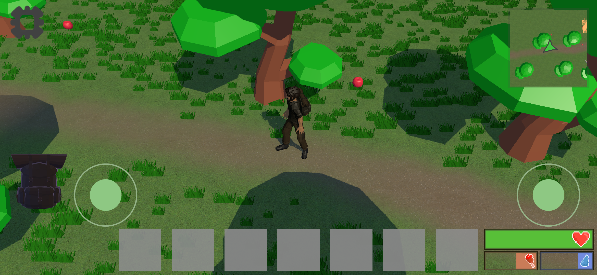</td>
    <td align="center"><b>Dark Forest</b><br>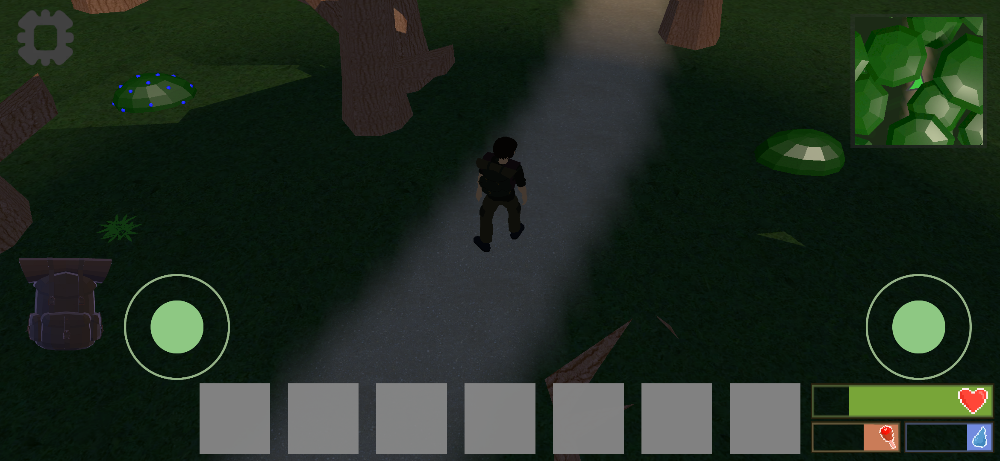</td>
  </tr>
  <tr>
    <td align="center"><b>Graveyard</b><br>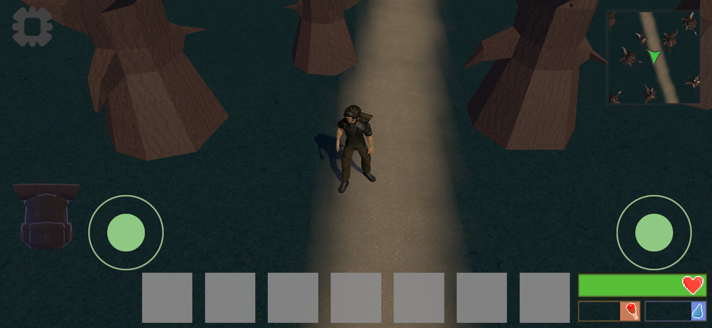</td>
    <td align="center"><b>Desert</b><br>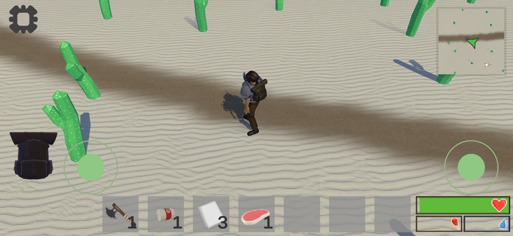</td>
  </tr>
</table>

- 🍖 **Survival needs**
  - Health, hunger and thirst bars
  - Hunger and thirst drop over time, when they drop to zero you start losing health
  - Eat apples and lamb
  - Drink water and collect water bottles at wells
  - Heal with bandages
  - Death screen that shows which enemy killed you and time alive

<table align="center">
  <tr>
    <td align="center"><b>Eating, drinking & healing</b><br>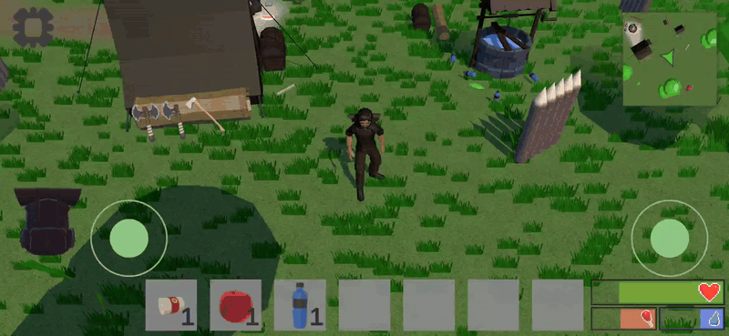</td>
    <td align="center"><b>Death screen</b><br>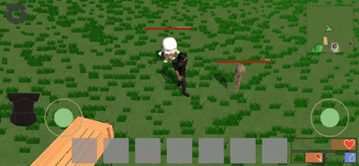</td>
  </tr>
</table>

- 🪓 **Gathering**
  - Chop trees and harvest cacti
  - Click the gather button **to gather**
  - Pick up stones, sticks, hemp and more
  - Resources respawn at **random** and **static** spots over time

<table align="center">
  <tr>
    <td align="center"><b>Gathering</b><br>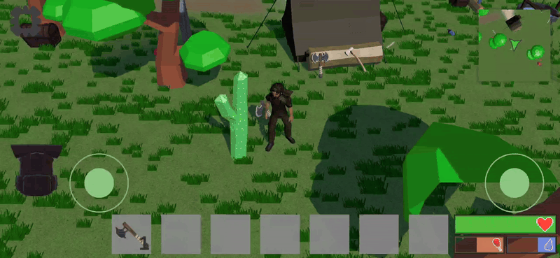</td>
  </tr>
</table>

- 🎒 **Inventory, crafting & building**
  - Drag and drop items between inventory and hotbar
  - Double-tap to drop an item or equip armour
  - To craft, open inventory (backpack image)
  - Crafting recipes are pre-made, tap recipe to craft it
  - Crafting recipes:
    - **Axe** – 1 Stone + 1 Stick
    - **Cloth** – 2 Hemp
    - **Bandage** – 2 Cloth
    - **Wooden Wall** – 5 Sticks
  - Place buildable items (like walls) in the world
  - You can store items inside storage chests

<table align="center">
  <tr>
    <td align="center"><b>Crafting</b><br>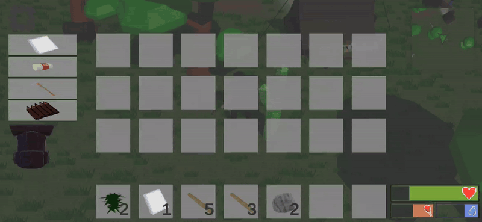</td>
    <td align="center"><b>Building</b><br>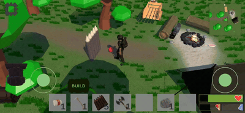</td>
  </tr>
</table>

- ⚔️ **Combat**
  - Weapons: Axe, Battle Axe, Double Battle Axe (each with its own damage and cooldown)
  - Armour: Leather and Metal, which reduce damage to a player
  - Enemies: Meadow Hunter, Forest Runner, Desert Hunter, Soul and the Desert King boss
  - Enemies patrol, chase, attack, and respawn after a while
  - Defeated enemies drop loot chest with random items from a biome-specific loot table, which disappears if not looted in time

<table align="center">
  <tr>
    <td align="center"><b>Combat & loot combat chest</b><br></td>
  </tr>
</table>

- 🐑 **Wildlife**
  - Sheep wander around and run away when you hit them
  - Kill them for lamb

<table align="center">
  <tr>
    <td align="center"><b>Sheep</b><br>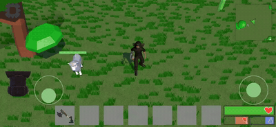</td>
  </tr>
</table>

- 💾 **Save system**
  - Auto-saves when you leave or pause the app
  - Saves your position, stats, inventory, armour, chests and items dropped in the world
  - Settings get saved

- 📱 **Mobile controls**
  - Virtual joystick
  - Attack, gather and interact buttons that only show up when you can use them


## 📸 All Screenshots
<details open>
<summary>📸 <b>All screenshots</b></summary>
<br>

<table align="center">
  <tr>
    <td align="center"><b>Gameplay</b><br>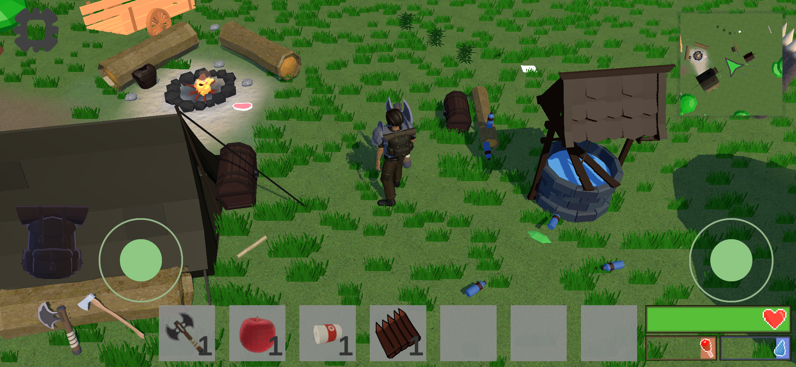</td>
    <td align="center"><b>Gathering</b><br>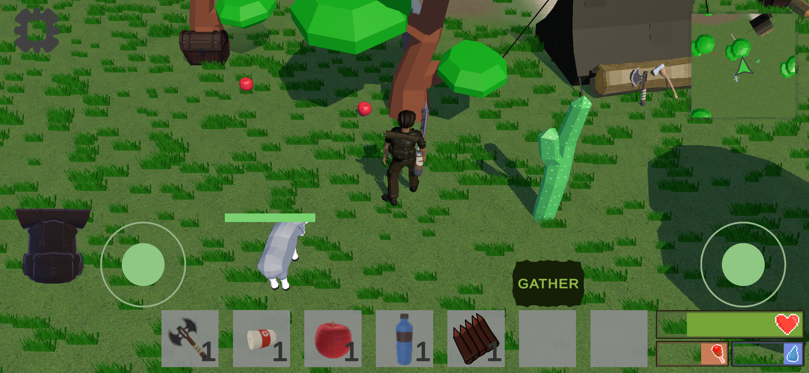</td>
  </tr>
  <tr>
    <td align="center"><b>Inventory</b><br>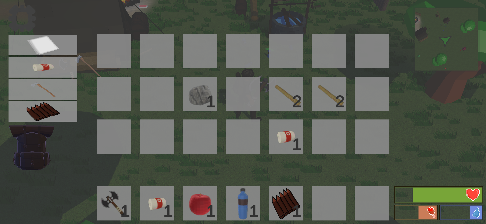</td>
    <td align="center"><b>Building</b><br>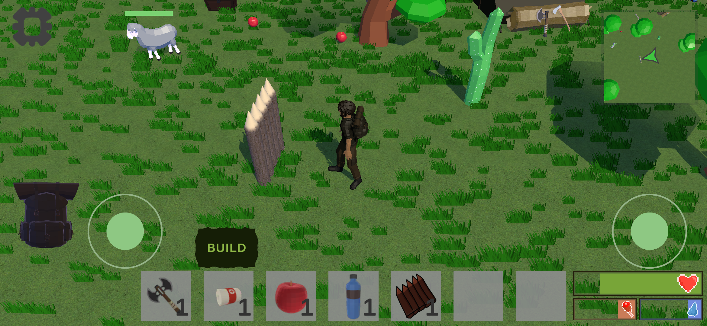</td>
  </tr>
  <tr>
    <td align="center"><b>Combat</b><br>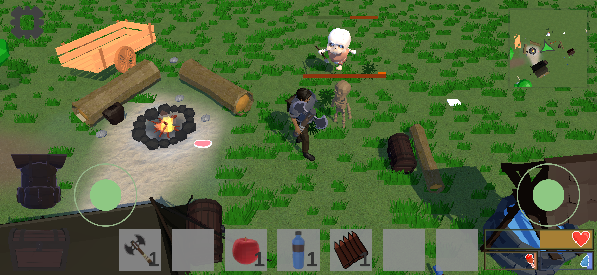</td>
    <td align="center"><b>Loot chest</b><br>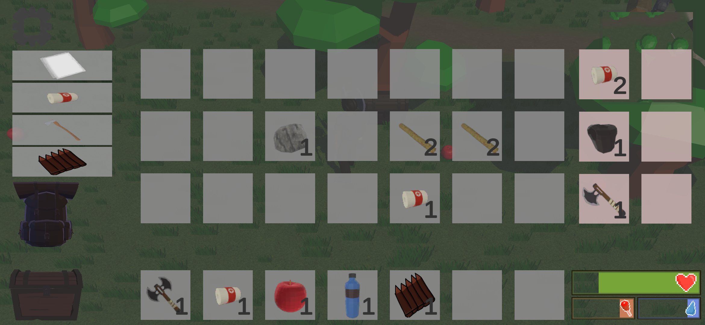</td>
  </tr>
  <tr>
    <td align="center"><b>Plains</b><br></td>
    <td align="center"><b>Desert</b><br></td>
  </tr>
  <tr>
    <td align="center"><b>Dark Forest</b><br></td>
    <td align="center"><b>Graveyard</b><br></td>
  </tr>
  <tr>
    <td align="center"><b>Map</b><br>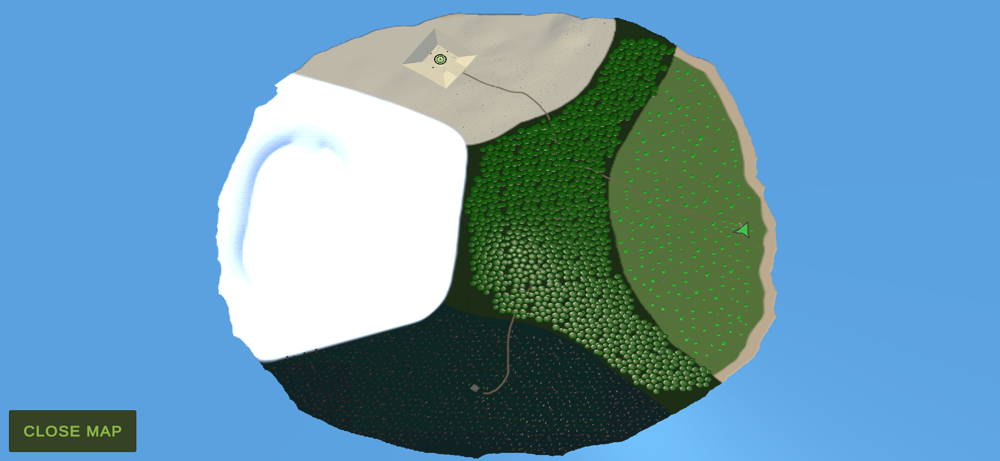</td>
    <td align="center"><b>Death screen</b><br>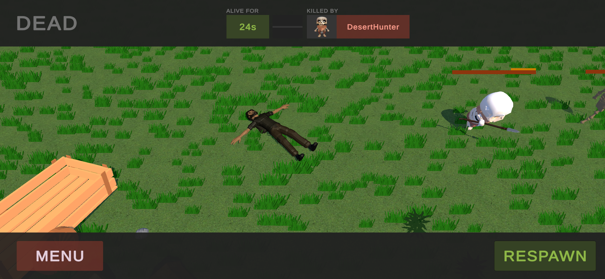</td>
  </tr>
</table>

</details>

## 💻 Tech Stack

- 🎮 Unity 2021.3.7f1 with C#
- 💾 JSON save files with optional **XOR encryption**

## 📋 Requirements

### 📱 To play
- Android phone running **Android 5.1 (API 22) or newer**
- Landscape mode

### 🛠️ To build and develop
- **Unity 2021.3.7f1** (install it with Unity Hub)
- Android Build Support module (with Android SDK & NDK and OpenJDK), add them in Unity Hub

## 🚀 Install & Run

1. Clone the project
   ```bash
   git clone https://github.com/S1monPet/Olusion.git
   ```
2. Open Unity Hub → **Add** → select the `Matura` folder
3. Open it with Unity **2021.3.7f1**
4. Open `Assets/Scenes/Menu.unity` and press **Play**
5. To build for Android: **File → Build Settings → Android → Switch Platform → Build**

## 📁 Project Structure

The gameplay code is organised by system:

```
Matura/Assets/Scripts
├── Animals/          - Wildlife AI (prey, predator)
├── Building/         - Placing buildable items
├── Canvas/           - Minimap, death screen and chest UI
├── Chest/            - Chests and loot tables
├── Crafting/         - Recipes
├── Enemy/            - Enemy AI and bosses
├── FruitCutter/      - Fruit Cutter mini-game (first idea for high school graduation)
├── GeatherScripts/   - Trees, cacti and gathering
├── Inventory/        - Inventory, slots and items
├── MainMenuScripts/  - Main menu and sound
├── ObjectPooling/    - Object pooling
├── Optimization/     - Tick system for AI updates
├── Player/           - Movement, attack, health food and water
├── SaveAndLoad/      - Save system
├── SceneManagement/  - Async scene loading
└── World/            - Day/night cycle, spawners and wells
```

### ⚡ Optimizations
- Enemy AI updates on a 0.2 s **tick** instead of every frame, this saves CPU on phones
- **Object pooling**: enemies, animals, resources and chests are reused (disabled and re-enabled) instead of destroyed and recreated
- **Occlusion culling**: only what the camera can actually see is rendered, objects outside the view or hidden behind other objects are not
- **Static batching**: non-moving objects like rocks are combined, so they're drawn in fewer draw calls
- **GPU instancing**: many copies of the same object, like trees, cacti and sheep, are drawn together in one call
- **ScriptableObjects**: item, enemy, recipe and loot data is stored once and shared, instead of copied into every object, saving memory

---

## 🤝 Credits

- 👥 Made by [@Maercel](https://github.com/Maercel) and [@S1monPet](https://github.com/S1monPet)
- 🕹️ [Joystick Pack](https://assetstore.unity.com/packages/tools/input-management/joystick-pack-107631) by Fenerax Studios
